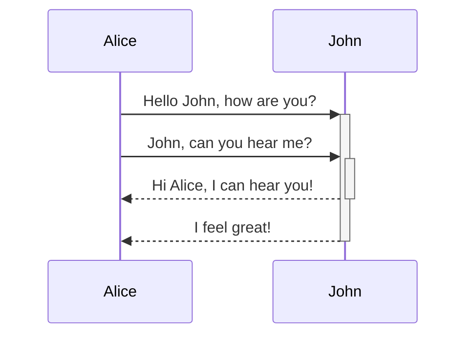

## Markdown Syntax + Funktionen Test
1. ==Markierung funktioniert==
2. Einrückung funktioniert
> Test123

3. Codeblöcke funktionieren?
```
Test 12345
```

*Kursiver Text*
5. Math-Blocks?
$$
x = \frac{{-b \pm \sqrt{{b^2 - 4ac}}}}{{2a}}

$$

6. Verlinkungen zu anderen .md pages?
[[index]]
7. Vorschau?
![[index]]

8. Mermaid diagramme sollten funktionieren:

9. Callouts
> [!info] Title
> 
> This is a callout!
> 

> [!warning] Warning
> 
> This is a callout!

> [!question] Can callouts be nested?
> > [!todo] Yes!, they can.
> > > [!example]  You can even use multiple layers of nesting.
> > 


Auch eigene Callouts hinzufügen:
```
.callout {
  &[data-callout="custom"] {
    --color: #customcolor;
    --border: #custombordercolor;
    --bg: #custombg;
    --callout-icon: url("data:image/svg+xml; utf8, <custom formatted svg>"); //SVG icon code
  }
}
```

10. Tabellen hinzufügen?

| ==Beautiful Table== | WOW   |
| ------------------- | ----- |
| sgrgrgf             | 12343 |
